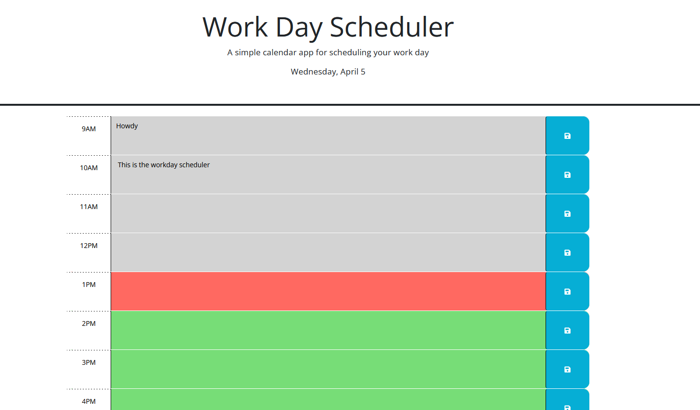

# Work-Day-Scheduler

## Description
Allows you to schedule the current workday. The data persists between session and the date is update as well. On top of that each timebloc is color coated:

- Green is the timeblock(s) in the future
- Red is the current timeblock
- Gray is the timeblock(s) in the past

You can access the page [here](https://davidpeguero.github.io/Work-Day-Scheduler/)

### Screnshots

#### Zoomed Out App

## Usage
To use simply write an event that you want to schedule into a timeblock and click the save button to the right. 

If you do so your schedule should be save even if you leave/refresh the page.

## Installation 
N/A

## License
MIT License